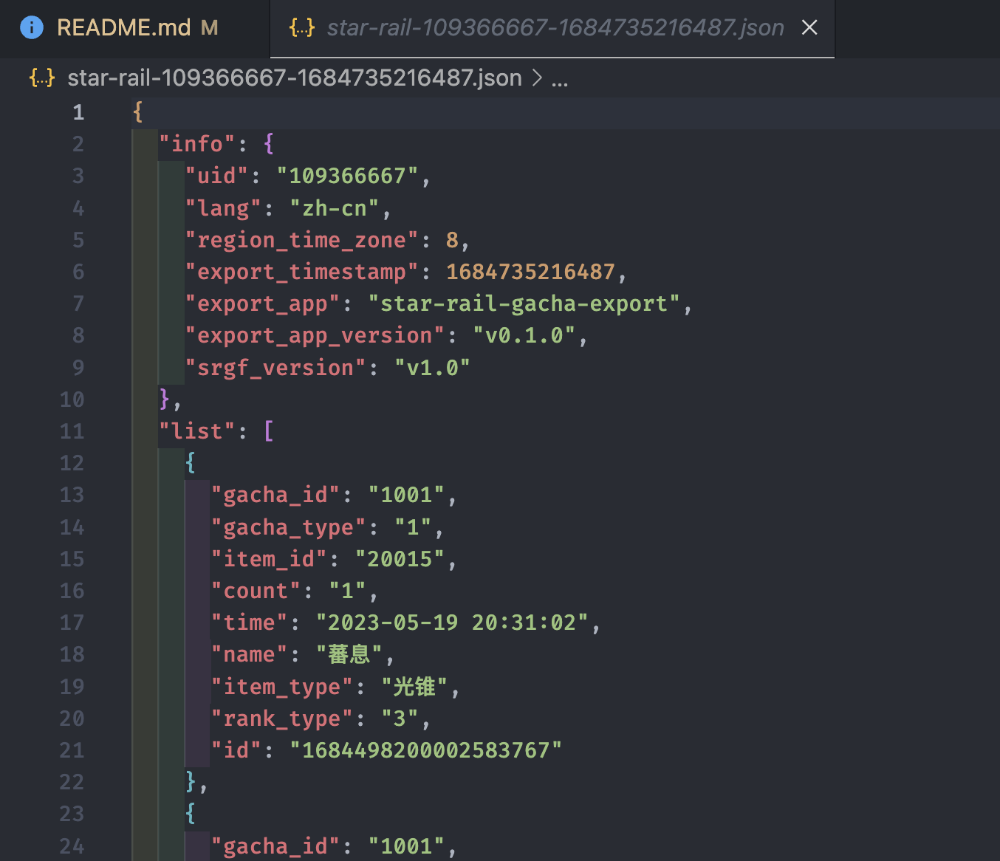
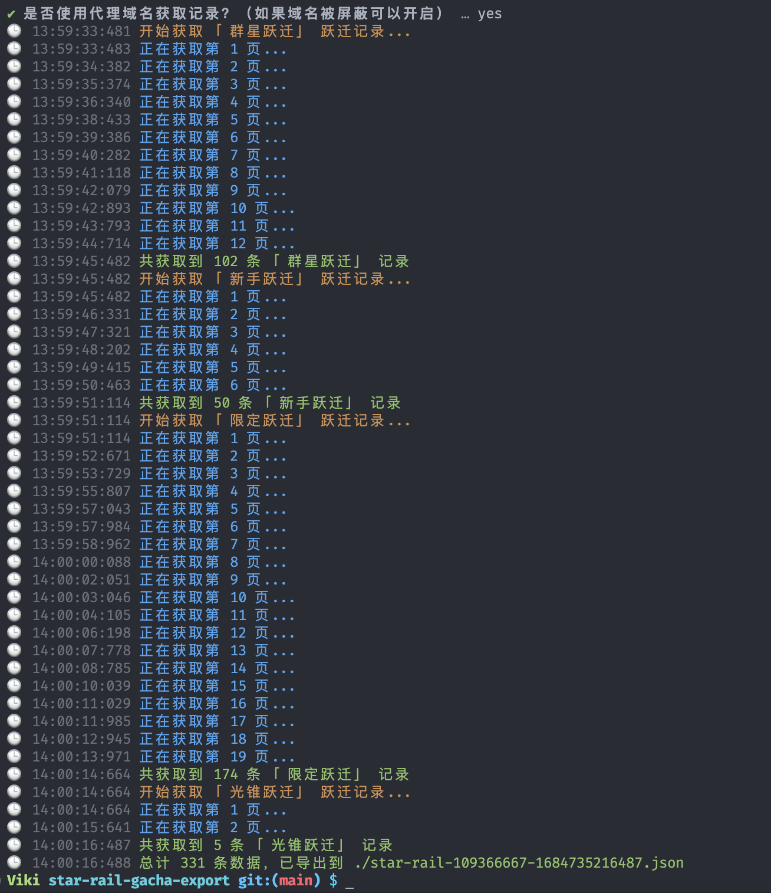

# 「崩坏 · 星穹铁道」 跃迁记录导出脚本

> 通过跃迁记录的 URL 快速获取符合 [SRGF](https://uigf.org/zh/standards/SRGF.html) v1.0 规范的跃迁记录数据，便于自身存档、其他同类工具消费。实际使用中的效果截图见文末。

## 如何使用？

> 请确保安装了 [Git](https://git-scm.com/) 和 [Node.js](https://nodejs.org/) 环境。

### 1. 克隆本仓库

```bash
git clone git@github.com:vikiboss/star-rail-gacha-export.git
```

### 2. 安装依赖

```bash
cd star-rail-gacha-export
npm install
```

### 3. 执行脚本

```bash
npm run dev
```

### 4. 按提示操作

根据提示输入跃迁链接并确认，跃迁链接获取方式[参考这里](https://mp.weixin.qq.com/s/CzSTvRDJ3C3SVDQKPcLvVA)。

完成后，记录文件将保存至当前目录的 `star-rail-[uid]-[timestamp].json` 文件中。

## 使用截图

输出的格式符合 SRGF v1.0 规范，输出的数据示例如下。



操作日志输出参考如下。



### License

MIT
